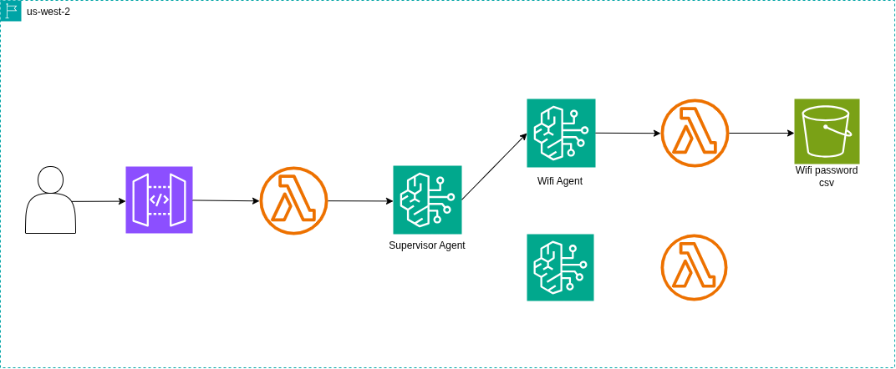

# 🧠 Bedrock Agent Chat App

This project is a **Next.js** web application that allows you to chat with an **Amazon Bedrock Agent** using the **Bedrock Agent Runtime SDK**.  
It provides a simple UI where users can send messages and receive AI-generated responses in real time.

---

## 🚀 System Architecture



## 🚀 Features

- 💬 Real-time chat interface with Bedrock Agent
- 🧩 Session management using unique session IDs
- ⚡ API route integration with AWS Bedrock
- 🔄 Loading state indicators
- 🧱 Built using Next.js 15+ (App Router)

---

## 🧰 Tech Stack

- **Frontend:** Next.js (React)
- **Backend:** AWS Bedrock Agent Runtime SDK
- **Language:** JavaScript (ES6+)
- **Runtime:** Node.js 18+
- **Environment:** Vercel or AWS Amplify (recommended)

---

## 📁 Project Structure

```
app/
├── api/
│ └── bedrock/
│ └── route.js # API route for communicating with AWS Bedrock Agent
├── page.js # Main chat UI
├── globals.css # Add your styles here
.env.local # Environment variables
```

````

---

## ⚙️ Setup & Configuration

### 1️⃣ Clone the repository
```bash
git clone https://github.com/yourusername/bedrock-agent-chat.git
cd bedrock-agent-chat
````

## 📁 Install dependencies

```
npm install
```

## Configure environment variables

Create a .env.local file in the project root and add your credentials:

```
BEDROCK_REGION=us-east-1
BEDROCK_AGENT_ID=your-agent-id
BEDROCK_AGENT_ALIAS_ID=your-alias-id
```

🛡️ Note: Never commit .env.local to version control. It contains sensitive information.

## How It Works

- The frontend (app/page.js) handles user input and displays the chat.
- When you send a message, it calls the API route (/api/bedrock/route.js).
- The API uses BedrockAgentRuntimeClient to invoke your Bedrock Agent.
- Responses stream back and are displayed in the chat window.

## Run the App

Development Mode

```
npm run dev
```
